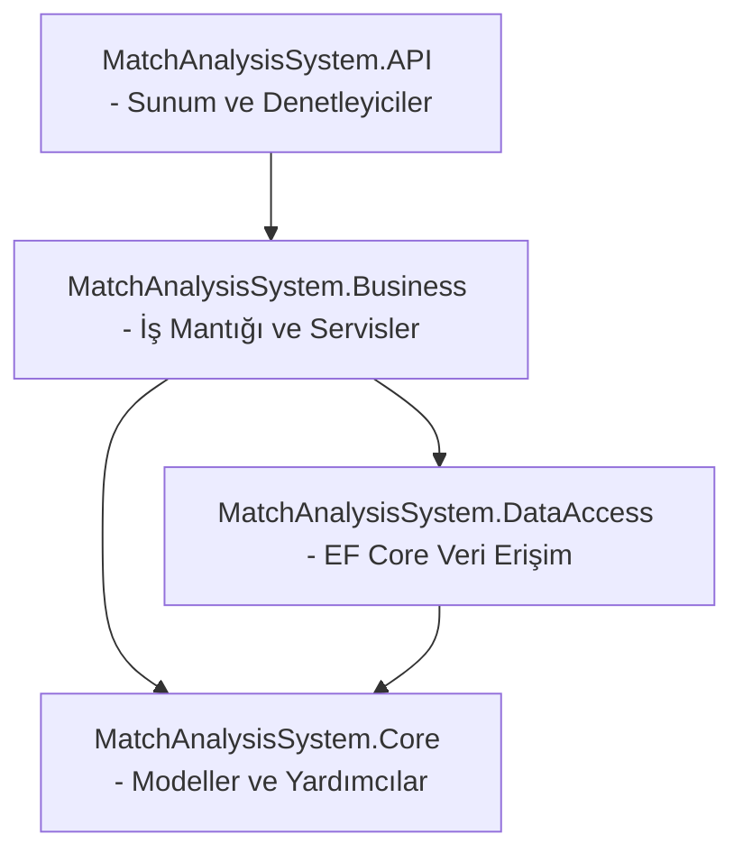

# ⚽ Yapay Zekâ Destekli Maç Analiz ve Tahmin Sistemi (V2)

Bu proje, futbolseverler, analistler ve bahisçiler için geliştirilmiş, endüstri standartlarında **Katmanlı Mimari (N-Tier Architecture)** deseni kullanılarak tasarlanmış modern bir futbol analiz, xG (gol beklentisi) ve skor tahmin sistemidir. 

Sistem, RapidAPI üzerinden anlık canlı bülten verilerini çeker, e-spor ve simüle ligleri akıllı filtrelerle ayıklar, takımların son 5 maçlık form durumlarını üstel ağırlıkla (EMA) damıtır ve **6x6 Poisson Olasılık Matrisi** kullanarak bilimsel maç tahminleri üretir. API kotalarını korumak için yüksek hızlı **Azure SQL veritabanı önbellekleme (Caching)** katmanı barındırır.

---

## 🚀 Öne Çıkan Özellikler

*   **Temiz Futbol Bülteni:** Lig adlarında geçen `SRL` (Simulated Reality League), `Cyber`, `Virtual`, `Esoccer`, `U19` ve `Women` gibi kelimeleri analiz ederek sanal, e-spor ve genç/kadın ligi maçlarını otomatik filtreler ve bülteni temizler.
*   **EMA (Exponential Moving Average) Form Hesaplama:** Takımların son 5 maçtaki performansını hesaplarken, en yeni oynanan maça en yüksek ağırlığı (`alpha = 0.35` düzleştirme faktörü ile) vererek form katsayılarını en gerçekçi şekilde modeller.
*   **6x6 Poisson Olasılık Matrisi:** Ev sahibi ve deplasmanın gol beklentilerini (xG) hesapladıktan sonra Poisson olasılık formülünü kullanarak 0-0'dan 5-5'e kadar toplam 36 farklı skor kombinasyonunu olasılıklandırır. Bu olasılıkları toplayarak:
    *   **1X2 (Taraf Kazanma) Olasılıkları**,
    *   **2.5 Alt / Üst Olasılıkları**,
    *   **Matristeki En Yüksek Olasılıklı Net Skoru** (`MostLikelyScore`) seçer.
*   **Kararlı 32-bit FNV-1a Hash Algoritması (`StableIdHelper`):** RapidAPI'den gelen string tipindeki takım ID'lerini (`participantId`), .NET'in oturumlar arası değişen kararsız `GetHashCode()` yerine, oturumdan bağımsız, kararlı tam sayılara (integer ID) dönüştürür.
*   **Azure SQL Caching Katmanı:** Aynı gün yapılan tahmin isteklerini `homeTeamId_awayTeamId_yyyyMMdd` formatındaki `CacheKey` ile veritabanında saklayarak API kotalarını korur ve tekrarlı isteklerde 1 saniyenin altında yanıt süresi sunar.
---

## 🏛️ Proje Yazılım Mimarisi (N-Tier)

Proje, katmanlar arası bağımlılıkları minimize etmek ve kodun test edilebilirliğini artırmak üzere 4 katmanlı Clean N-Tier mimarisiyle yapılandırılmıştır:



### Katman Sorumlulukları ve Dosya Yapısı:

1.  **`MatchAnalysisSystem.Core` (Çekirdek Katmanı):**
    *   `Entities/`: `Team.cs` (takım güç ratingleri), `MatchHistory.cs` (maç detayları), `LiveFixture.cs` (anlık fikstürler) ve `MatchPrediction.cs` (tahmin veri modeli) sınıflarını barındırır.
    *   `Helpers/`: Deterministik ve kararlı integer ID üretimi sağlayan `StableIdHelper.cs` sınıfını içerir.
2.  **`MatchAnalysisSystem.DataAccess` (Veri Erişim Katmanı):**
    *   `MatchDbContext.cs`: Veritabanı tablolarını, 1-N ev sahibi/deplasman ilişkilerini (`Restrict` kuralı ile) ve `CacheKey` için benzersiz indeks yapılandırmalarını (Fluent API) barındırır.
    *   `Migrations/`: Veritabanı şemasının sürüm geçmişini tutan göç (migration) dosyaları.
3.  **`MatchAnalysisSystem.Business` (İş Mantığı Katmanı):**
    *   `Services/FootballApiService.cs`: RapidAPI bağlantısını sağlar, sanal lig ayıklamasını yapar ve korner/kart istatistik simülasyonunu yönetir.
    *   `Services/PoissonAnalysisManager.cs`: Üstel hareketli ortalama (EMA) ile form durumunu çıkarır ve 6x6 Poisson olasılık matrisi üzerinden tahminleri üretir.
    *   `Services/MatchPredictionService.cs`: Önbellek kontrolünü ve veritabanı ile API arasındaki koordinasyonu yönetir.
    *   `Services/DataManagementManager.cs`: Takım ekleme/listeleme ve maç geçmişi ekleme gibi CRUD operasyonlarını yönetir.
4.  **`MatchAnalysisSystem.API` (Presentation - Sunum Katmanı):**
    *   `Controllers/MatchController.cs`: `/api/Match/daily-fixtures`, `/api/Match/predict` ve `/api/Match/add-team` gibi RESTful API uç noktalarını dış dünyaya açar.
    *   `wwwroot/`: Premium koyu tema (`index.html`), Bootstrap bileşenleri ve akıllı taktik yorum derleyicisini barındıran kullanıcı arayüzü.
    *   `Program.cs`: IoC Container bağımlılıklarını (Dependency Injection), DbContext bağlantısını ve uygulama ayağa kalkarken otomatik migration koşturan (`db.Database.Migrate()`) kodu barındırır.

---

## 🛠️ Kullanılan Teknolojiler

*   **Platform / Dil:** .NET 9.0 (C# 13)
*   **Web API Çatısı:** ASP.NET Core Web API
*   **ORM:** Entity Framework Core 9.0
*   **Veritabanı:** Microsoft SQL Server / Azure SQL Database
*   **Test Altyapısı:** xUnit ve Moq (Birim Testler)
*   **Arayüz:** Vanilla HTML5, CSS3, JavaScript, Bootstrap 5 & Bootstrap Icons
*   **Dış Entegrasyon:** RapidAPI Flashlive Sports API

---

## 🔌 API Uç Noktaları (REST API Endpoints)

| Metot | Uç Nokta (Endpoint) | Erişim Yetkisi | Açıklama |
| :--- | :--- | :--- | :--- |
| **GET** | `/api/Match/daily-fixtures` | Anonim | Bugün oynanacak, simülasyonlardan arındırılmış temiz fikstür bültenini döner. |
| **GET** | `/api/Match/predict` | Anonim | Ev sahibi ve deplasman için xG, 1X2 olasılıkları, Alt/Üst ve en olası skoru döner. Önbellekte varsa doğrudan DB'den okur. |
| **POST** | `/api/Match/add-team` | Anonim | Veritabanına isim ve hücum/savunma ratingleri ile yeni takım ekler. |
| **POST** | `/api/Match/add-match-history` | Anonim | Takımların geçmiş maç skorları ile korner/kart istatistiklerini veritabanına kaydeder. |

---

## ⚙️ Kurulum ve Çalıştırma Talimatları

### Gereksinimler:
*   [.NET 9.0 SDK](https://dotnet.microsoft.com/en-us/download/dotnet/9.0)
*   [SQL Server](https://www.microsoft.com/en-us/sql-server/sql-server-downloads) (Yerel veya Azure SQL Instance)
*   RapidAPI Flashlive Sports API anahtarı (Varsayılan olarak `FootballApiService.cs` içerisinde tanımlıdır)

### Adımlar:

1.  **Repository'yi Klonlayın:**
    ```bash
    git clone https://github.com/Mac-Analiz-Ve-Tahmin/AI-Destekli-Mac-Analiz-ve-Tahmin-Sistemi.git
    cd AI-Destekli-Mac-Analiz-ve-Tahmin-Sistemi/MatchAnalysisSystem_V2
    ```

2.  **Veritabanı Bağlantısını Yapılandırın:**
    `MatchAnalysisSystem.API` klasöründe yer alan `appsettings.json` dosyasını açarak `ConnectionStrings` altındaki veritabanı adresinizi düzenleyin:
    ```json
    "ConnectionStrings": {
      "DefaultConnection": "Server=YOUR_SERVER;Initial Catalog=MatchAnalysisDB;User ID=YOUR_USER;Password=YOUR_PASSWORD;Encrypt=True;TrustServerCertificate=True;"
    }
    ```

3.  **Proje Bağımlılıklarını Geri Yükleyin:**
    ```bash
    dotnet restore
    ```

4.  **Uygulamayı Çalıştırın (Otomatik Migrations Aktiftir):**
    ```bash
    dotnet run --project MatchAnalysisSystem.API
    ```
    *Uygulama ilk açılışta `Program.cs` içerisindeki göç motoru sayesinde Azure SQL veritabanında gerekli tüm tabloları (`Teams`, `MatchHistories`, `MatchPredictions`) ve indeksleri otomatik oluşturacaktır.*

5.  **Tarayıcıdan Erişin:**
    *   **Kullanıcı Arayüzü (UI):** `http://localhost:5000/index.html` (veya konsolda belirtilen HTTPS adresi)
    *   **Swagger API Test Arayüzü:** `http://localhost:5000/swagger`

---

## 🧪 Birim Testlerin Çalıştırılması (xUnit)

İş mantığı ve tahmin algoritmalarının doğruluğunu test etmek için `tests/` klasöründe yer alan xUnit testlerini koşturabilirsiniz:
```bash
dotnet test
```

---

## 📋 Proje Takımı ve Görev Dağılımı

*   **Abdulkadir** - Proje Lideri / Full-Stack Yazılım Geliştirici / Yapay Zekâ ve Veritabanı Sorumlusu
    *   *Sorumluluklar:* Katmanlı mimari kurulumu, EF Core ve Azure SQL yapılandırması, FNV-1a Hash algoritması (`StableIdHelper`), Poisson Dağılım Modeli ve EMA düzleştirme formüllerinin implementasyonu.

---

## 📄 Lisans

Bu proje **MIT Lisansı** ile lisanslanmıştır. Detaylar için [LICENSE](../LICENSE) dosyasını inceleyebilirsiniz.